# P1XEL

## Introduction

P1xel app gives you the opportunity to view and rate games, new and old, popular or less known, save them to your Want To Play or Have Played list, add your own comments and ratings. You can even link your Steam account, view your profile, the games you own, view your friends or compare Steam achievements between you and your friends.

## Table of contents

[Introduction](#introduction)
[Description](#description)
[Link To Deployed Application](#link-to-deployed-application)
[Getting started](#getting-started)
[Technologies Used](#technologies-used)
[Wire Frames](#wire-frames)
[Database Model](#database-model)
[Screenshots](#screenshots)
[Future Improvements](#future-improvements)
[License](#license)
[Contact the Team](#contact-the-team)

## Description

P1xel App is a Full-Stack application that focuses on the Gaming industry.

When a user first opens our app, he will be met by our landing page that displays a carousel of games.

If the user does not have an account, he can choose to create one by visiting the Sign-up page. Once the user reaches the Sign-up page, he can pass in his credentials, choose a username and add some information into the "About Me" section.

Once the account is successfully created, the user is redirected to his Profile page where he can view his logo and about me section. If, on registration, he chose to provide his Steam ID, he can view his Steam information such as, Steam Logo, Last Time Online, Recently Played Games, and his Steam Friends. He can also access his or his friends`s steam account by clicking on the "View on Steam" link.

When searching for a game, the user will be redirected to the search results games and all of the games that match his search will be displayed, together with a photo, summary, launch date and score.

When the user selects a game, he will be redirected to a page displaying more detailed information about that game.

For every game displayed on the search results page, the user can choose to add it to his "Want To Play" or "Have Played" list.

If the user knows one of the other users, he can Follow him. When a user follows another user, he gets added to a list showing all the people he follows, to have easier access to their information and content.

If the user tries to access one of the private routes such as the dashboard, he will be redirected to the Login page. If he does not own an account, he can then choose to go to the Sign-up page to create an account.

## Link To Deployed Application

You can visit our application by clicking [here](#)

## Getting started

First, clone our repository by opening your terminal and running the following command:

`git clone git@github.com:ivnkris/p1xel.git`

Make sure to first select the desired folder in which you will clone our repository;

Then, change your folder to the one containing our application:

`cd p1xel`

The third step is to install all of the dependencies. To do this, type in:

`npm install`

Now, you need to open the application with your code editor. If you are using Visual Studio Code, type in the terminal the following command:

`code .`

Now, to run the app on your local machine, open the terminal in VSCode and run the app by typing in

`npm run start`

## Technologies Used

### MVC

We have focused on building our app on the MVC architecture to be able to offer best experiences to users but also to other developers that might want to contribute to our project in the future.

For our server we chose to use Express.js. By choosing this package we made sure that we can create a safe-to use, easy-to-configure server and all of the endpoints that we needed, also taking in consideration performance,

The database we used is MySQL. We chose to pair MySQL with the Sequelize package to make sure that designing and implementing the database structure will be fast, but also customized to our users needs. Using Sequelize made finalizing the data structure much faster and easier.

For our templating language we have chose Handlebars. Handlebars was really easy to use, and, having both built-in helpers and custom helpers, allowed us to customize our pages however we wanted. Using Handlebars really sped up the process so we can focus mor on offering the best User Experience we can.

### API

We also get some information from two Third Party API`s.

The first API we have used is the [IGDB](https://www.igdb.com/api) API. This is the API that is providing us all of the Games data as well as ratings, reviews, launch dates or platforms that different games are released on.

The second API that we have used is teh [Steam](https://developer.valvesoftware.com/wiki/Steam_Web_API#GetPlayerSummaries_.28v0001.29) API. This brings back all of the Steam information such as, user profile, logout dates, user logo, friends and recently played games.

We have also created our own API to be able to view, add, edit and remove data from our API. You can access the documentation for our API by accessing [this link](https://tudor-tocan.gitbook.io/p1xel/games/get-game-by-id)

## Wire frames

We have used Draw.io to plan our application. We designed the main pages on a very high level knowing that our design will evolve along with the application itself. Again, we have focused on offering the best experience we could, for our users. You can view our wire frame by following [this link](https://app.diagrams.net/#Hivnkris%2Fp1xel%2Fmain%2FPixel%20Routes). You can also find a screenshot of the wire frame, below:

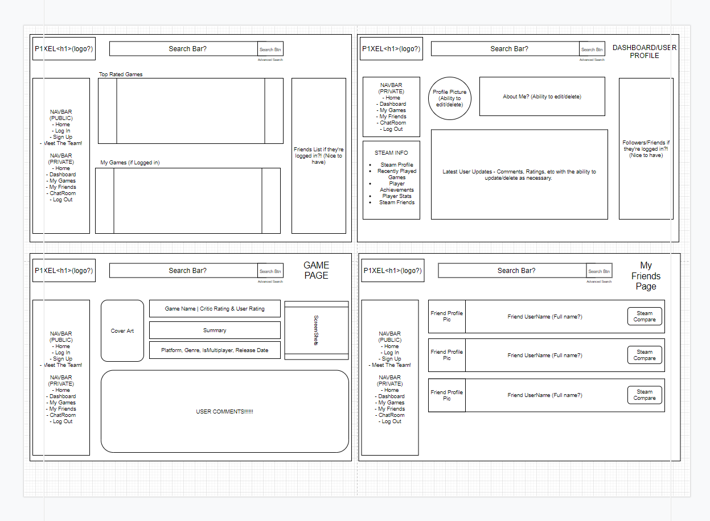

## Database Model

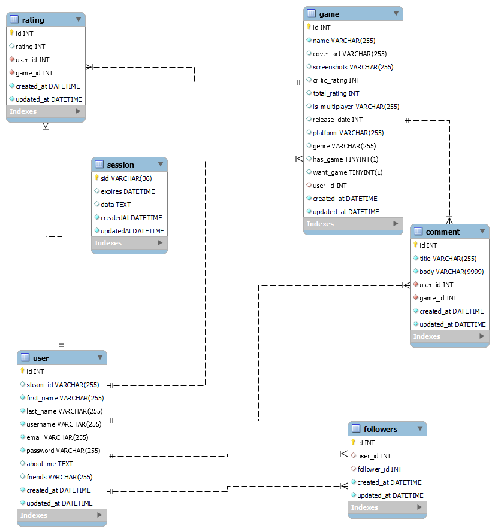

## Screenshots

Public Homepage

Private Homepage

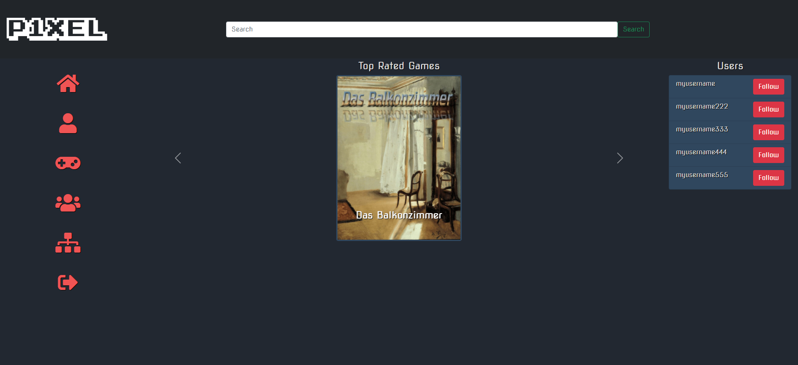

Game Page

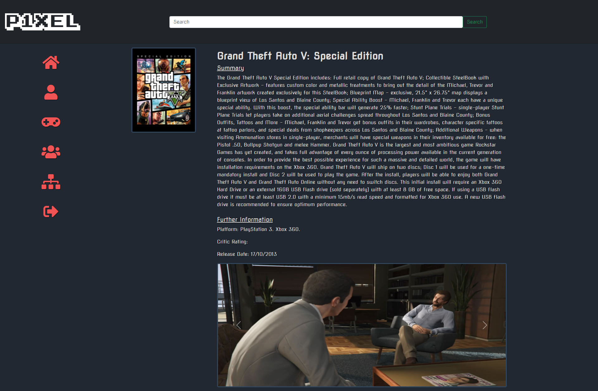

Followers Page

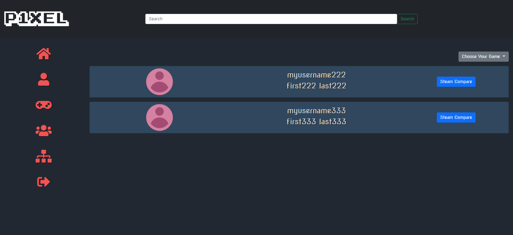

Team Page

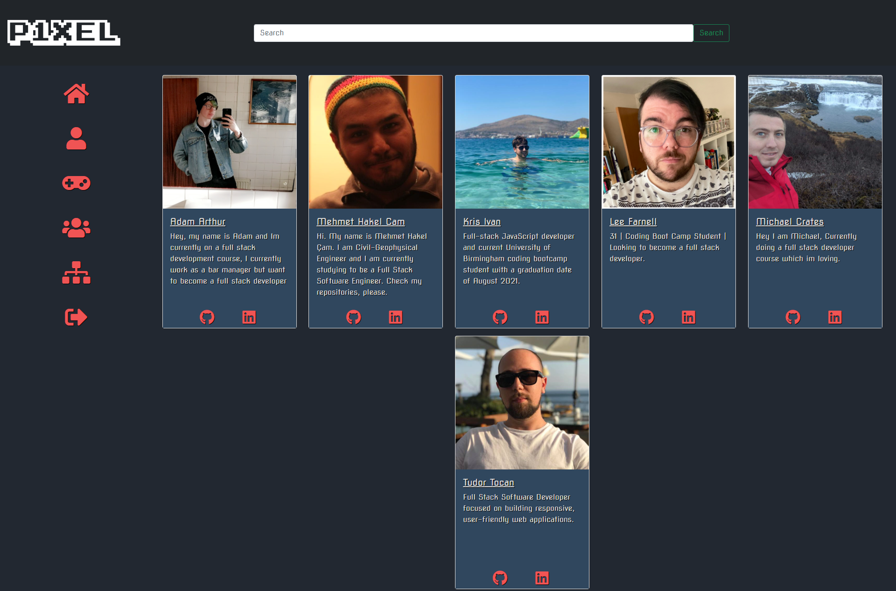

Login Page

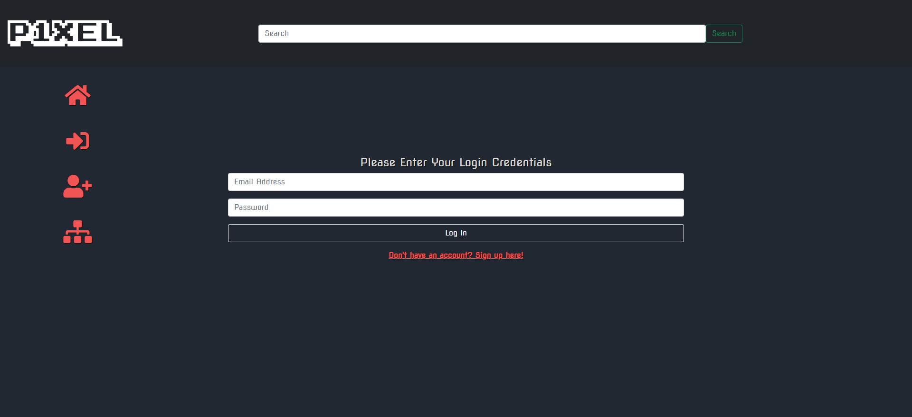

Signup Page

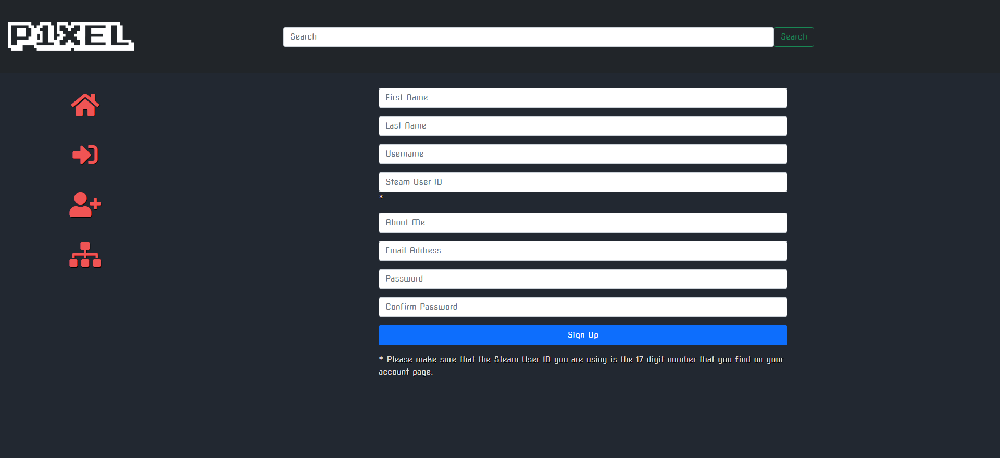

Profile Page

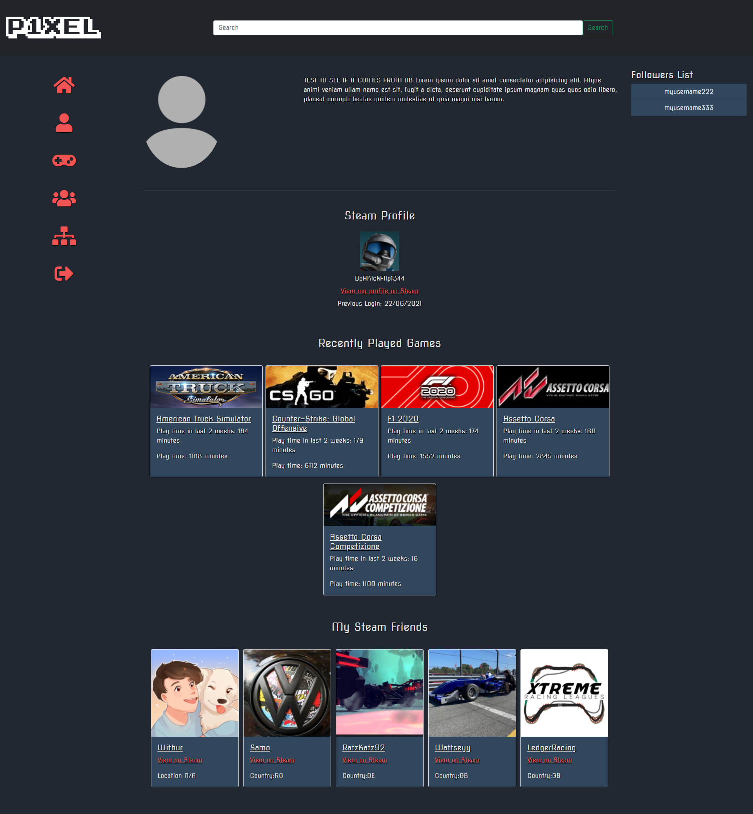

Search Results Page

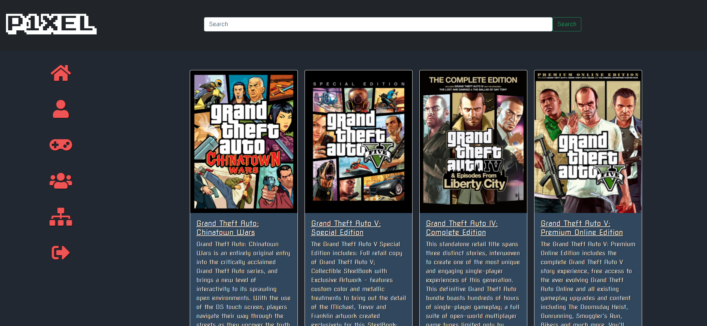

Compare Steam Achievements Page

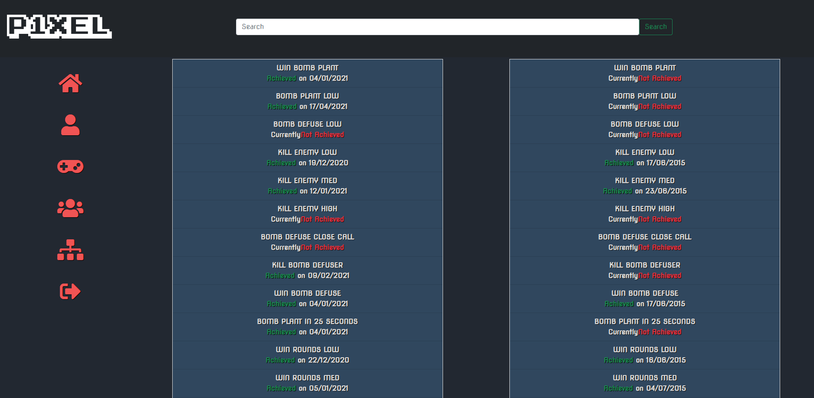

## Future Improvements

For the future we have already planned a few features.

First, we would like to replace the "Follow" functionality and allow the user to actually be able to send friend requests and the user receiving notifications for any pending friend requests.

Another feature we would like to implement is a live chatroom for every user to use either globally in our app or within their friends group.

## License

P1xel Application is licensed under the MIT license

## Contact the Team

For any questions you can reach to us via GitHub or LinkedIn:

- Adam Arthur: [GitHub](), [LinkedIn]()
- Lee Farnell: [GitHub](https://github.com/LeeFarnell), [LinkedIn]()
- Mehmet Hakel Cam: [GitHub](https://github.com/Hakkelo89), [LinkedIn]()
- Michael Crates: [GitHub](https://github.com/Cratesy), [LinkedIn]()
- Kris Ivan: [GitHub](https://github.com/ivnkris), [LinkedIn]()
- Tudor Tocan: [GitHub](https://github.com/ttudorandrei), [LinkedIn]()
